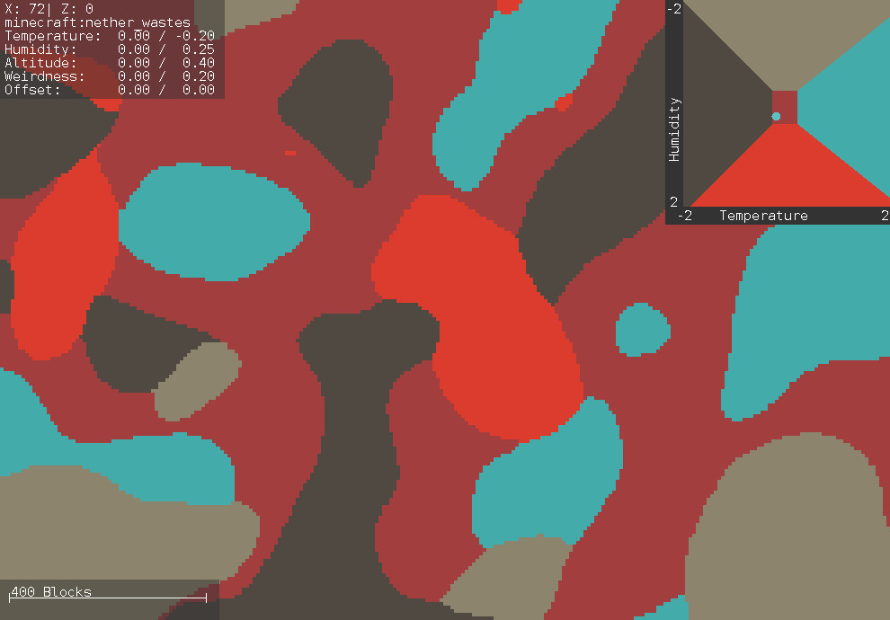

Minecraft Multi-Noise Visualization
===================================



This program lets you quickly see how your biome distribution looks
like. You do not need to create a world with the definition. Not
even a working datapack is needed - just your ``dimension.json``
file. The only requirement is that it uses the
``minecraft:multi_noise`` biome-source type.

### Installation
1. Download the zip from the [releases page](https://github.com/jacobsjo/MinecraftMultiNoiseVisualization/releases)
1. Unzip the zip file
1. Download the official **1.16.2** ``server.jar`` file from [here](https://launcher.mojang.com/v1/objects/c5f6fb23c3876461d46ec380421e42b289789530/server.jar) (note: by doing so you agree to the Minecraft EULA and privacy policy - see [here](https://www.minecraft.net/en-us/download/server/))
1. Put the ``server.jar`` into the ``MinecraftMultiNoiseVisualization`` you have just extracted
1. Start the Program using ``java -jar MinecraftMultiNoiseVisualization-0.1.jar``

### Usage
When you open the program, you will see the visualization for the vanilla nether. Use this
oportunity to familiarize yourself with the interface before you start looking at
your own datapacks. I don't think I need to explain to you how to use the map - just use the mouse to scroll and
 the mouse-wheel to zoom. In the top left corner you will see some information about
the current mouse position. The first line shows the coordinates, and the second
shows the biome at that location. The remaining lines show the climate parameters of
that biome (before the ``/``) and the current climate (after the ``/``).

##### Voroni Diagram
The top right shows a [Voronoi diagram](https://en.wikipedia.org/wiki/Voronoi_diagram) using two
of the dimensions. You can change which of the dimenions to show using the context menu (right-click anywhere)
->``Set Voronoi diagram``. A circle will show the position that corresponds to the climate at the mouse position.
The not-shown dimensions of the climate are also automatically updated based on the climate
at the mouse position.

##### Open Dimension
Now it is time for you to open your own ``dimension.json`` file. Simply go to ``context-menu -> Open Dimension json``
and choose the ``json`` file that contains your Multi-Noise definition. If you later change that file, the visualization
will automatically be updated. If your definition contains a seed than this seed will be used and the ``Set seed`` and ``Random seed``
options will be disabled to avoid confution. To go back to the vanilla nether, go to ``context-meu -> Open Vanilla Nether``.

##### Highlight Biome
By going to ``context menu->highlight biome`` you can highlight a specific biome. Simply write the full (namespaced)
name of the biome into the dialoge box (prepopulated based on where you opened the context menu)

##### Copy Teleport command
If you want to check out a specific location in-game, you can simply click on ``context-menu -> Copy teleport command``
and a ``tp`` command will be copied to the clipboard that you can pase in-game. If the program has determined the
namespaced name of your dimension (based on the path) this command will include an ``execute in ...`` part at the start,
such that you can call as soon as you created the world.

### Development
- Clone this repository
- inside the repository create a folder called ``minecraft-server-jars``
- Download the official **1.16.2** ``server.jar`` file from [here](https://launcher.mojang.com/v1/objects/c5f6fb23c3876461d46ec380421e42b289789530/server.jar) and put it inside that folder (note: by doing so you agree to the Minecraft EULA and privacy policy - see [here](https://www.minecraft.net/en-us/download/server/))
- Download the official **1.16.2** server mappings ``server.txt`` file from [here](TODO) and also put it in the ``minecraft-server-jar`` folder.
- Use [Reconstruct](https://github.com/LXGaming/Reconstruct) to deobfuscate the ``server.jar`` into ``server-deobf.jar`` using the following command: 
```
java -jar Reconstruct-1.1.0.jar -jar server.jar -mapping server.txt -output server-deobf.jar -exclude org.apache -exclude joptsimple -exclude it.unimi.dsi -exclude com.mojang -exclude com.google -exclude io.netty -exclude javax.annotation
```
- Use ``gradle build`` or ``gradle jar`` to build the program.
- To deploy, use ``gradle prodJar`` (obfuscates part of the jar such that is works agains an obfucated ``server.jar``) or ``gradle zipProd`` to produce the final zip file.